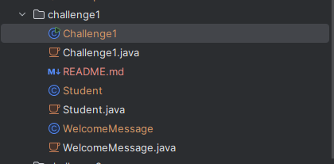

# DOSW_Lab1_Aguirre_Gonzales_Nieto-

---

## Miembros del equipo

- Camilo Alejandro Aguirre
- Sara Sofia Gonzales Mora
- Juan Sebastian Nieto Herrera

---

## Teamwork Agreements

- We will divide the work at the beginning of the lab's publication date. Members of this group will have a minimum of 5 hours before the lab submission deadline to complete their assigned part.
- If anyone has a question about another member's work, feel free to ask.
- We will work equitably and collaboratively throughout the semester.
- There is no need to worry about submission dates as we will be responsible for our part of the lab.
- Finally, we will enjoy this process and learn in every lab.

### Meeting times

As a group, we decided to meet every Monday from 17:00 to 22:00 and on Wednesday at the same time.

### Communication channels

- WhatsApp and Teams

### Frequency of our meetings

- Weekly

### How would we resolve a conflict

We would view the problem objectively and first discuss it among ourselves as team members, attempting to find a solution. If the conflict is difficult to resolve, consulting Professor Laura would be the final step.

---

## Laboratory 1 – Git, GitHub and Functional Programming

### Challenge 1 — Welcome Message

#### Evidence

##### 1. Project Structure

##### 2. Program Execution

##### 3. Git Commit

---

### Description

#### What was implemented

A Java application was developed using functional programming concepts. A `Student` class was created to store each team member's information, while the `WelcomeMessage` class generates a welcome message using Java Streams, lambda expressions, `map()`, and `collect()`. Finally, the `Challenge1` class executes the application and displays the results.

#### How the work was divided

Camilo Aguirre implemented Challenge 1, including the creation of the `Student`, `WelcomeMessage`, and `Challenge1` classes. The remaining team members were assigned to the other challenges of the laboratory.

#### Which Git operations were used

The following Git commands were used during the development of this challenge:

- `git checkout`
- `git status`
- `git add`
- `git commit`
- `git push`

#### Which conflicts appeared

A merge conflict occurred because changes were initially made in the wrong feature branch after switching branches.

#### How the conflicts were resolved

The conflict was resolved by restoring the correct files, removing the conflict markers, verifying the code, and committing the corrected version to the appropriate branch.

---

## Pruebas de Impugnacion

---

## Explicaciones Tecnicas

---

## Respuestas al Cuestionario Conceptual

---
