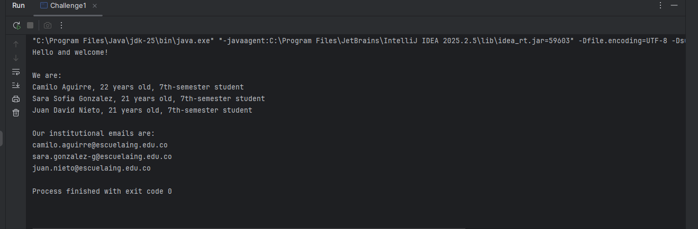
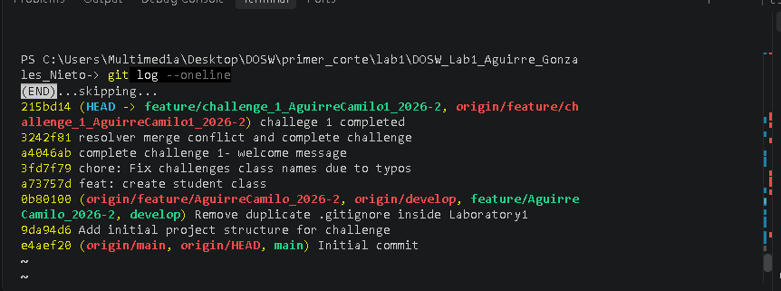
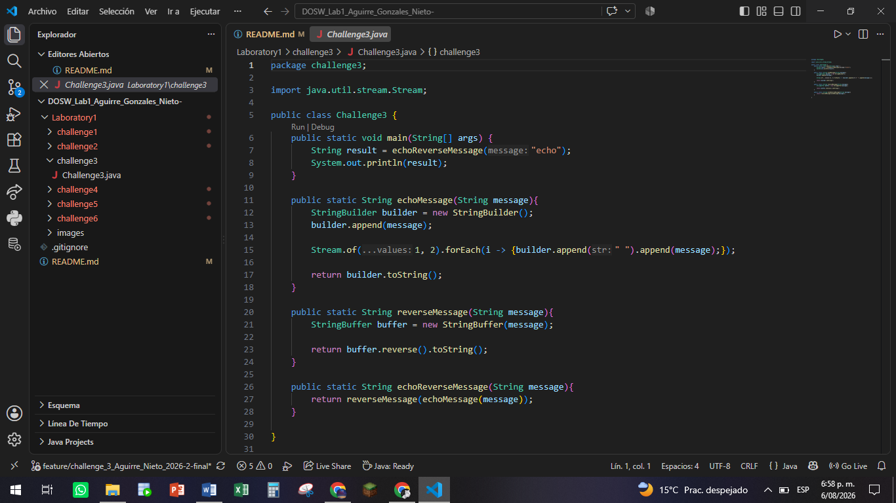
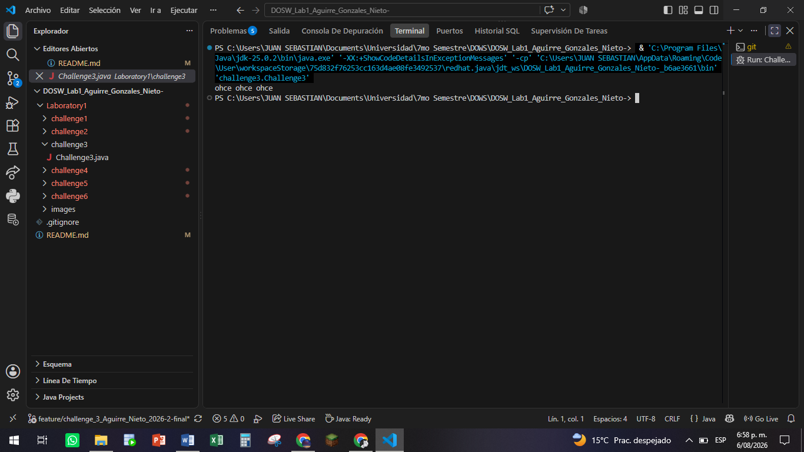
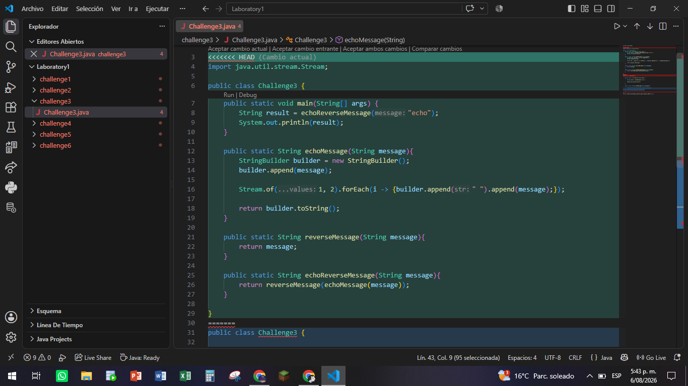
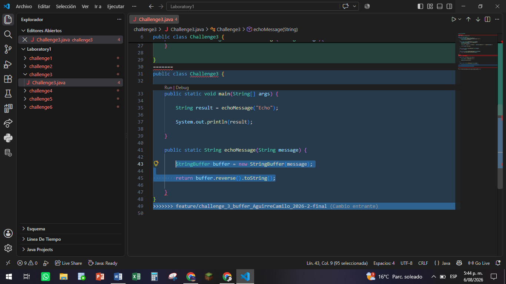
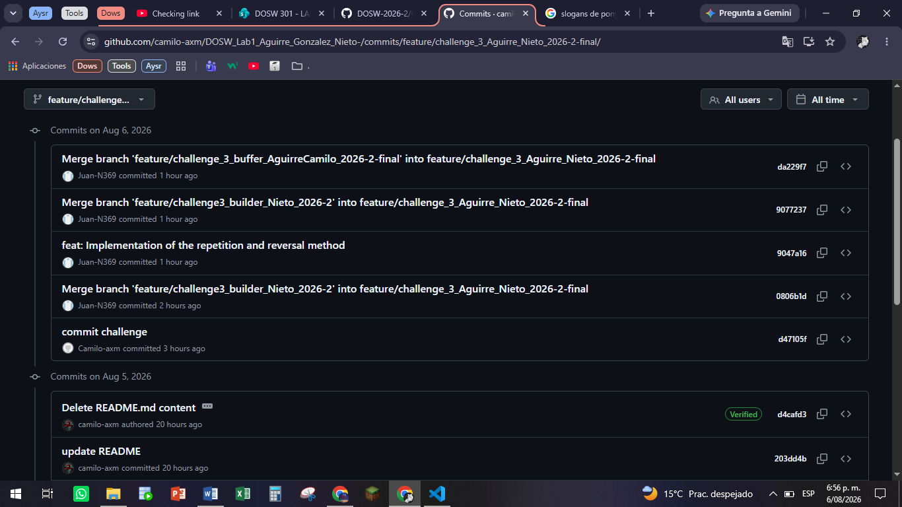
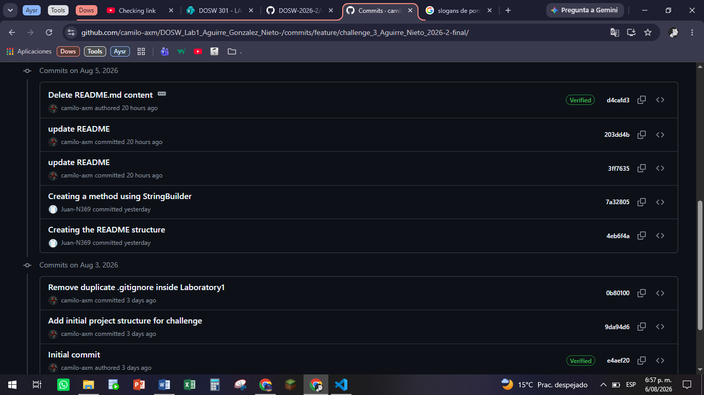

# DOSW_Lab1_Aguirre_Gonzalez_Nieto-

# DOSW Laboratory 1 – Git, GitHub and Functional Programming

# Introduction
This laboratory was developed as a practical experience focused on applying collaborative software development practices together with functional programming concepts in Java.

Throughout the laboratory, our team worked on different programming challenges that required us to organize the development process through Git branches, commits, merges, and conflict resolution. At the same time, we applied Java features such as lambda expressions, Streams, collections, and functional interfaces to solve different problems.

Rather than focusing only on completing the programming exercises, this laboratory allowed us to experience a collaborative workflow similar to the one used in real software development projects. Each team member worked on specific tasks, maintained their own branches, contributed commits, and participated in the integration of the final solutions.

# Purpose

The main purpose of this laboratory was to combine software development and version control practices in a single collaborative project.

The activities were designed to help us understand how individual contributions can be developed independently and later integrated into a common codebase. The programming challenges also provided an opportunity to apply functional programming techniques to practical situations.

# Main Goals

Through the development of this laboratory, we aimed to:

-Strengthen our understanding of Git and GitHub as collaborative development tools.

-Practice working with branches and maintaining an organized development history.

-Gain experience creating commits that clearly represent development progress.

-Understand how merge conflicts occur and how they can be resolved.

-Apply Java lambda expressions and functional interfaces.

-Use Streams to transform, filter, and process collections of data.

-Work with different Java collection structures such as HashMap, Hashtable, HashSet, and TreeSet.

-Improve our ability to integrate different implementations into a single working solution.

-Document the development process and the decisions made throughout the laboratory.

-Methodology

The laboratory was completed through a collaborative workflow in which responsibilities were distributed among the team members.

For each challenge, the required functionality was developed in separate branches when necessary. Changes were committed progressively and later integrated through merge operations. When conflicts appeared, the affected files were reviewed manually to preserve the valid contributions from each branch.

This workflow allowed us to practice not only programming, but also coordination, version control, code integration, and technical documentation.

# Repository Contents

This repository contains the Java implementations developed during the laboratory, together with the evidence and documentation of the development process.

# The main contents are:

Challenge 1: Functional welcome message using student information.

Challenge 2: Processing numerical lists through parallel development and merge conflicts.

Challenge 3: String manipulation using StringBuilder, StringBuffer, lambdas, and Streams.

Challenge 4: Combination and processing of HashMap and Hashtable collections.

Challenge 5: Processing and merging HashSet and TreeSet collections.

Challenge 6: Command execution using switch, Map<String, Runnable>, and lambda expressions.

Conceptual Questionnaire: Answers related to Git, branching, merging, Java Streams, and collections.

# Learning Outcomes

At the end of the laboratory, we gained practical experience in both collaborative development and Java programming. In particular, we improved our ability to work with Git workflows, integrate contributions from multiple developers, identify conflicts, and apply functional programming techniques to different programming problems.

The following sections document the evidence, implementation details, Git operations, conflict resolution processes, and conceptual answers developed by our team.

## Team Members

- Camilo Aguirre
- Sara Sofia Gonzalez
- Juan David Nieto


## Challenge 1 — Welcome Message

### Evidence

### 1. Project Structure


### 2. Program Execution



### 3. Git Commit



### Description

### What was implemented

A Java application was developed using functional programming concepts. A `Student` class was created to store each team member's information, while the `WelcomeMessage` class generates a welcome message using Java Streams, lambda expressions, `map()`, and `collect()`. Finally, the `Challenge1` class executes the application and displays the results.

### How the work was divided

Camilo Aguirre implemented Challenge 1, including the creation of the `Student`, `WelcomeMessage`, and `Challenge1` classes. The remaining team members were assigned to the other challenges of the laboratory.

### Which Git operations were used

The following Git commands were used during the development of this challenge:

- `git checkout`
- `git status`
- `git add`
- `git commit`
- `git push`

### Which conflicts appeared

A merge conflict occurred because the changes were initially made in the wrong feature branch after switching branches.

### How the conflicts were resolved

The conflict was resolved by restoring the correct files, removing the conflict markers (`<<<<<<<`, `=======`, `>>>>>>>`), verifying the code, and committing the corrected version to the appropriate branch.

## Challenge 2 — Parallel Commit Race

### Evidence
Conflicts


Results


### Description

During this challenge, we implemented several lambda-based methods to process lists of integers. The final program obtains the maximum value, minimum value, total number of elements, verifies whether the maximum value is divisible by 2, and checks whether the list size is odd or even. Finally, the methods were tested using two different lists in the `main` method.

The work was divided between both team members. One branch was responsible for implementing the maximum value function and the validations related to it, while the other branch implemented the minimum value function, the total number of elements, and the list size validation. After completing the individual tasks, both branches were merged into the main challenge branch.

The Git operations used during the challenge included:

- `git checkout`
- `git branch`
- `git add`
- `git commit`
- `git merge`
- `git stash`
- `git stash pop`
- `git log --oneline --graph --decorate --all`

Merge conflicts appeared because both branches modified the same Java file (`ParallelRace.java`) and added methods in similar sections of the code. The conflicts were resolved manually by reviewing both implementations, keeping the required methods from each branch, correcting method names and syntax errors, and ensuring that all functions worked together correctly before creating the final version.

## Challenge 3 — The Mysterious Echo

### Evidence









### Description

In this challenge, three methods were implemented: one to reverse a given `String`, another to repeat a given `String` three times, and a third that combines the previous two methods to produce the reversed message repeated three times. A `main` method was also implemented to test the functionality by passing the string `"echo"` to the `echo` method, producing the output `"ohce ohce ohce"` in the terminal.

The work was divided between Juan Nieto and Camilo Aguirre. Each team member implemented the first two methods and their own version of the third method. Afterwards, both branches were merged, resolving conflicts to obtain the final solution for the challenge. During the process, the following Git commands were used:

 * `git status`
 * `git checkout`
 * `git switch`
 * `git branch`
 * `git add`
 * `git commit`
 * `git merge`
 * `git log`
 * `git fetch`

## Challenge 6 — The Decision Machine

Evidence


Description
What was implemented
A Java command execution system called The Decision Machine was implemented. The application executes different text commands using a switch statement and a Map<String, Runnable>, where each command is associated with a lambda expression. The final implementation supports the following commands:

GREET
FAREWELL
SING
DANCE
JOKE
SHOUT
WHISPER
ANALYZE
How the work was divided
The project was developed collaboratively using two feature branches.

Student A implemented:

GREET
FAREWELL
SING
DANCE
Student B implemented:

JOKE
SHOUT
WHISPER
ANALYZE
After completing the assigned tasks, both implementations were merged into a single version of the project.

Which Git operations were used
The following Git commands were used during the development process:

git branch
git checkout
git add
git commit
git push
git pull
git merge
git fetch
git log --oneline --graph --decorate --all
Which conflicts appeared
Merge conflicts occurred because both students modified the same source file while implementing different commands. Git was unable to automatically determine which changes should be kept during the merge process.

How the conflicts were resolved
The conflicts were resolved manually by reviewing the conflicting sections and preserving the valid changes from both branches. Once the conflicts were resolved, the project was compiled and tested to verify that every command worked correctly. Finally, the merged version was committed and pushed to the remote repository.


Questions
Team Agreements: Add the agreements you defined in the Onboarding section here.

What is the difference between `git merge` and `git rebase`?

The difference lies in how they manage the commit history. `git merge` combines the contents of two branches by merging the commits, while `git rebase` rewrites the history and moves the base of the current branch to the latest commit of the final branch.

What happens when two branches modify the same line of a file?
Git cannot automatically determine which version to keep, resulting in a conflict.

How can you graphically visualize the branch and merge history in the terminal?

`git log --graph --oneline --all --decorate`
`git config --global alias.tree "log --graph --oneline --all --decorate"`

What is the difference between a `commit` and a `push`?

``` `git commit` saves changes to the local repository, and `git push` sends the confirmed commits to a repository like GitHub to update the server.

What are `git stash` and `git stash pop` used for?
`git stash` temporarily stores changes in a pending work stack and cleans up the directory, while `git stash pop` retrieves the most recently saved changes and removes them from the stash.

What is the difference between `HashMap` and `Hashtable`? `Hashtable` blocks concurrent access but degrades performance, while `HashMap` is asynchronous and offers greater speed.

What advantages does `Collectors.toMap()` offer over a traditional loop?
Declarative programming, pipeline integration, and explicit collision handling.

When using `stream().map()` on a list of objects, what type of operation is performed?
It is an intermediate operation.

What does `stream().filter()` do, and what does it return? Evaluate each element of the Stream using a boolean and keep the sequence of elements whose evaluation is true, and return a Stream<T> containing the filtered subset of elements.

Describe the steps necessary to create a new feature branch from `develop`.

git checkout develop
git pull origin develop
git checkout -b feature/feature-name
git switch -c feature/feature-name

What is the difference between `git branch` and `git checkout -b`?

git branch <name>: Creates the branch in the local history, but doesn't switch to it. git checkout -b <name>: Creates the branch and performs the change (checkout).

Why should new functionality be developed in the `feature/*` branches instead of directly in `main`?
Code stability, task isolation, and CI/CD workflow.

## conceptual questionnaire

1. Team agreements: Add the agreements you defined in the Onboarding section here.

### Teamwork Agreements

- We will divide the work at the beginning of the lab's publication date, members of this group will have a minimun of 5 hours before the lab submission deadline to complete their assigned part.
- If anyone has a question about another members work, feel free to ask.
- We will work equitably and collaboratively throughout the semester.
- Ther's no need to wworry about dates of submission as well be responsible for our part of the lab.
- Finally we will enjoy this process and we are learn in every lab.

### Meeting times

- As a group we decided to meet every Monday from 17:00 to 22:00 and on Wednesday in the same  time.

### Communication channels

- Whatsapp and Teams

### Frequency of our meetings

- Weekly

### How would we resolve a conflict

- We would view the problem objectively and first, we discuss it among ourselves as a team members, attempting to find solution and after that if the conlict is hard we consulting to Profesor Laura would be the final step.

2. What is the difference between git merge and git rebase?

- While `git merge` preserves the commit history exactly as it occurred across the branches being merged, `git rebase` reapplies the commits from the current branch on top of the latest commit of the target branch, resulting in a cleaner, more linear commit history.

3. What happens when two branches modify the same line of a file?

- When two branches modify the same line of a file with completely different content, the outcome depends on the specific actions being taken; a conflict might arise that requires resolving by modifying the file to reconcile the differences, or—if explicitly specified—the change from one of the branches could take precedence.

4. How can you display the branch and merge history graphically in the terminal?

- Using the command `git log --graph --oneline --decorate --all`

5. What is the difference between a commit and a push?

- In Git, a `commit` records a snapshot of changes in the local repository, creating a new point in the project's history. On the other hand, a `push` uploads local commits that do not yet exist in the remote repository, making them accessible to others.

6. What are git stash and git stash pop used for?

- `git stash` is used to store uncommitted changes in the repository; these changes are saved onto a stack, allowing you to switch branches while keeping your repository clean. `git stash pop` retrieves the most recently stashed changes and applies them back to the current repository and branch.

7. What is the difference between HashMap and Hashtable?

- 7. What is the difference between a `HashMap` and a `Hashtable`?

The difference lies in thread safety: `HashMap` is not synchronized, whereas `Hashtable` is. This means that when an execution thread accesses a `Hashtable`, it blocks access for any other thread, whereas `HashMap` lacks these protections, meaning its data integrity could be compromised.

8. What advantages does Collectors.toMap() provide over a traditional loop?

- Its advantages include less code and a declarative coding style that is more intuitive and simple; additionally, it works with Streams and makes the task more straightforward than using a loop.

9. When using stream().map() on a list of objects, what type of operation is being performed?

- It iterates over each element and applies the operation specified in `.map()` to it; the value returned by this operation replaces the input value, resulting in a Stream containing the data types produced by the operation.

10. What does stream().filter() do, and what does it return?

- It iterates over the elements of the stream and evaluates a condition for each one; the elements that satisfy the condition provided to `.filter()` form a new stream.

11. Describe the steps required to create a new feature branch from develop.

- While on the `develop` branch, perform a `git pull` to update the branch and ensure the new one starts from the most recent point of `develop`. Then, create the new branch using the command `git checkout -b "branch name"` or `git switch -c "branch name"`. As a best practice, the branch name should reflect the specific reason for its creation, followed by a distinctive identifier to indicate who is working on it.

12. What is the difference between git branch and git checkout -b?

- While `git branch` is a command used to view and identify the current branches in your repository—whether local or remote, depending on how it is used—`git checkout -b` is used to create a new branch and switch to it from the current one, basing it on the history of the branch you were previously on.

13. Why should new functionality be developed in feature/* branches instead of directly in main?

- This approach provides control, structure, and organization to the way features are implemented. Consequently, if a feature fails, contains errors, or proves unnecessary, it does not affect the work already completed in `main` or the work of others in the repository.
